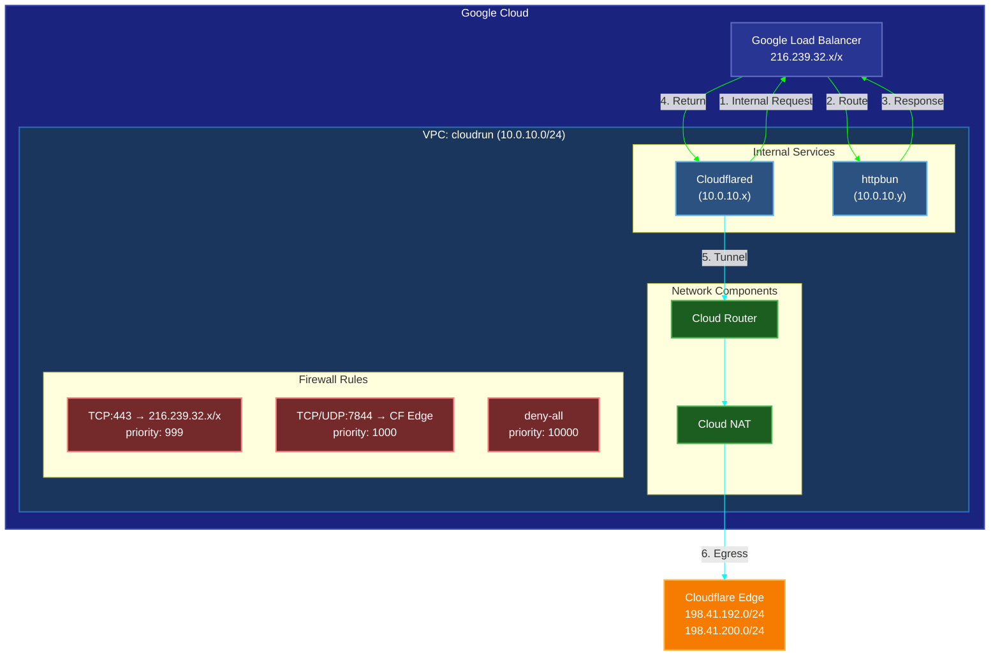

# Setting up Cloudflare Tunnel on Google Cloud Run

## Architecture Overview



## Network Setup

```bash
# Create VPC network
gcloud compute networks create cloudrun \
  --subnet-mode=custom \
  --description="Network for Cloudflare tunnel services"

# Create subnet
gcloud compute networks subnets create cfd \
  --network=cloudrun \
  --region=europe-west4 \
  --range=10.0.10.0/24

# Create Cloud Router
gcloud compute routers create cloudrun-router \
  --network=cloudrun \
  --region=europe-west4

# Create Cloud NAT
gcloud compute routers nats create cloudrun-nat \
  --router=cloudrun-router \
  --router-region=europe-west4 \
  --region=europe-west4 \
  --nat-all-subnet-ip-ranges \
  --auto-allocate-nat-external-ips

# Firewall Rules
# 1. Allow Google Load Balancer Traffic (Required for internal service communication)
gcloud compute firewall-rules create allow-lb-traffic \
  --network=cloudrun \
  --direction=egress \
  --action=allow \
  --rules=tcp:443 \
  --destination-ranges=216.239.32.x/x \
  --priority=999

# 2. Allow Cloudflare Edge Traffic
gcloud compute firewall-rules create allow-cf-traffic \
  --network=cloudrun \
  --direction=egress \
  --action=allow \
  --rules=tcp:7844,udp:7844 \
  --destination-ranges=198.41.192.0/24,198.41.200.0/24 \
  --priority=1000

# 3. Deny all other egress (recommended)
gcloud compute firewall-rules create deny-all \
  --network=cloudrun \
  --direction=egress \
  --action=deny \
  --rules=all \
  --destination-ranges=0.0.0.0/0 \
  --priority=10000
```

## Service Deployment

### Deploy Internal Service (httpbun)
```bash
gcloud run deploy httpbun \
  --image=kennethreitz/httpbin \
  --platform=managed \
  --region=europe-west4 \
  --port=80 \
  --network=cloudrun \
  --subnet=cfd \
  --ingress=internal
```

### Deploy Cloudflare Tunnel
```bash
gcloud run deploy cloudflared \
  --image=docker.io/cloudflare/cloudflared:latest \
  --platform=managed \
  --region=europe-west4 \
  --command=cloudflared \
  --args="tunnel,--no-autoupdate,--metrics,0.0.0.0:10000,--metrics-update-freq,5s,run,--token,your-tunnel-token" \
  --network=cloudrun \
  --subnet=cfd \
  --port=10000 \
  --ingress=internal \
  --min-instances=1
```

## Important Notes

### Network Flow
1. Cloud Run services are automatically assigned private IPs in the VPC subnet range (10.0.10.x)
2. Even with internal ingress, service-to-service communication goes through Google's load balancer (216.239.x.x)
3. The private IPs are used for VPC integration but not for direct HTTP communication
4. All egress to Cloudflare occurs through Cloud NAT

### Security Considerations
1. Internal ingress ensures services are not accessible from the public internet
2. Firewall rules restrict egress to only necessary destinations:
   - Google Load Balancer (required for internal communication)
   - Cloudflare edge servers (required for tunnel)
3. Deny-all rule blocks any other egress traffic
4. Services maintain private IP addresses but cannot be accessed directly via these IPs

### Best Practices
1. Always use `--min-instances=1` for cloudflared to maintain tunnel connectivity
2. Configure proper firewall rules to restrict egress
3. Enable Cloud NAT logging for troubleshooting
4. Monitor VPC flow logs for unexpected traffic

## Troubleshooting

### Common Issues
1. Service-to-service communication failing:
   - Verify firewall rules allow traffic to 216.239.x.x/x
   - Check service ingress settings
   - Verify both services are in same region

2. Tunnel connectivity issues:
   - Verify firewall rules allow Cloudflare IPs
   - Check NAT configuration
   - Review cloudflared logs

### Useful Commands
```bash
# Check service configuration
gcloud run services describe SERVICE_NAME --region=europe-west4

# View logs
gcloud run services logs read SERVICE_NAME --region=europe-west4

# Check NAT status
gcloud compute routers nats describe cloudrun-nat \
  --router=cloudrun-router \
  --router-region=europe-west4
```
