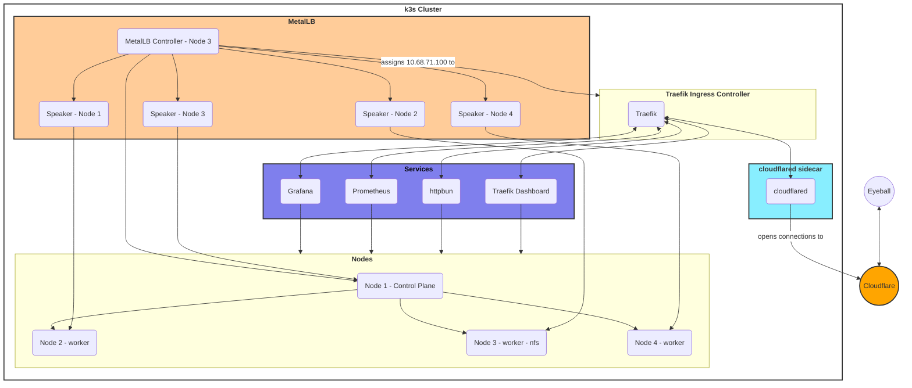

:::tip[Prerequisites]

Before we begin we need this set up: 
1. https://github.com/int128/kubelogin
2. Cloudflare Access
3. k8s/k3s/minikube
:::

## Cloudflare Access

### Step 1: Get an IDP setup (Google Workspace, Gmail, Entra ID, Authentic etc):

```hcl
resource "cloudflare_zero_trust_access_identity_provider" "gmail" {
  account_id = var.cloudflare_account_id
  name       = "Gmail"
  type       = "google"
  config {
    client_id        = var.google_client_id
    client_secret    = var.google_secret
    email_claim_name = "email"
  }
}

resource "cloudflare_zero_trust_access_identity_provider" "authentik_oidc" {
  account_id = var.cloudflare_account_id
  name       = "Authentik OIDC"
  type       = "oidc"
  config {
    auth_url         = "https://authentik.${var.domain_name}/application/o/authorize/"
    certs_url        = "https://authentik.${var.domain_name}/application/o/cloudflare-access/jwks/"
    claims           = ["given_name", "preferred_username", "nickname", "groups", "role"]
    client_id        = var.authentik_oidc_client_id
    client_secret    = var.authentik_oidc_secret
    email_claim_name = "email"
    scopes           = ["openid", "email", "profile"]
    token_url        = "https://authentik.${var.domain_name}/application/o/token/"
  }
}
```

### Step 2: Setup Access application, policies, groups and outputs

Application for kubectl:
```hcl
resource "cloudflare_zero_trust_access_application" "kubectl_saas" {
  account_id = var.cloudflare_account_id
  policies = [
    cloudflare_zero_trust_access_policy.allow_erfi.id,
  ]
  allowed_idps = [
    cloudflare_zero_trust_access_identity_provider.gmail.id,
    cloudflare_zero_trust_access_identity_provider.pin.id
  ]
  app_launcher_visible      = true
  auto_redirect_to_identity = false
  domain                    = "kubectl.${var.domain_name}"
  name                      = "kubectl"
  session_duration          = "24h"
  type                      = "saas"
  saas_app {
    auth_type = "oidc"
    redirect_uris = ["http://localhost:8000", "http://127.0.0.1:8000", "http://localhost:18000", "http://127.0.0.1:18000", "urn:ietf:wg:oauth:2.0:oob"]
    scopes = ["openid", "email", "profile", "groups"]
  }
}
```

Access Policy:

```hcl
resource "cloudflare_zero_trust_access_policy" "allow_erfi" {
  account_id = var.cloudflare_account_id
  name       = "Allow Erfi"
  decision         = "allow"
  session_duration = "30m"

  include {
    group = [cloudflare_zero_trust_access_group.erfi_corp.id]
  }
}
```

Access Group:

```hcl
resource "cloudflare_zero_trust_access_group" "erfi_corp" {
  account_id = var.cloudflare_account_id
  name       = "Erfi Corp"
  include {
    email = var.erfi_corp
  }
}
```

Output:

```hcl
output "kubectl_saas" {
  value = {
    client_id     = cloudflare_zero_trust_access_application.kubectl_saas.saas_app[0].client_id
    client_secret = cloudflare_zero_trust_access_application.kubectl_saas.saas_app[0].client_secret
    public_key    = cloudflare_zero_trust_access_application.kubectl_saas.saas_app[0].public_key
    auth_type     = cloudflare_zero_trust_access_application.kubectl_saas.saas_app[0].auth_type
    redirect_uris = cloudflare_zero_trust_access_application.kubectl_saas.saas_app[0].redirect_uris
    grant_types   = cloudflare_zero_trust_access_application.kubectl_saas.saas_app[0].grant_types
    scopes        = cloudflare_zero_trust_access_application.kubectl_saas.saas_app[0].scopes
    name          = cloudflare_zero_trust_access_application.kubectl_saas.name
    domain        = cloudflare_zero_trust_access_application.kubectl_saas.domain
    type          = cloudflare_zero_trust_access_application.kubectl_saas.type
  }
  sensitive = true
}
```
## k3s and Cloudflare Tunnel

### Step 3: Cloudflare Tunnel

#### Cloudflare Tunnel Deployment (instead of side-car)
DNS:

```hcl
resource "cloudflare_record" "kubectl" {
  zone_id = var.cloudflare_zone_id
  name    = "kubectl"
  type    = "CNAME"
  content = cloudflare_zero_trust_tunnel_cloudflared.k3s.cname
  proxied = true
  tags    = ["k3s"]
}
```

Tunnel Config:

```hcl
resource "cloudflare_zero_trust_tunnel_cloudflared_config" "k3s" {
  account_id = var.cloudflare_account_id
  tunnel_id  = cloudflare_zero_trust_tunnel_cloudflared.k3s.id
  config {
    warp_routing {
      enabled = true
    }
    ingress_rule {
      hostname = "kubectl.${var.domain_name}"
      service  = "https://10.0.71.9:6443"
      origin_request {
        origin_server_name = "https://kubernetes.default.svc.cluster.local"
        http2_origin       = true
        no_tls_verify      = true
      }
    }
    ingress_rule {
      service = "http_status:404"
    }
  }
}
```

Tunnel Secret:

```hcl
resource "cloudflare_zero_trust_tunnel_cloudflared" "k3s" {
  account_id = var.cloudflare_account_id
  name       = "k3s"
  secret     = base64encode(random_string.tunnel_secret.result)
  config_src = "cloudflare"
}

resource "random_string" "tunnel_secret" {
  length  = 32
  special = false
}
```

### Step 4: k3s deployments

Tunnel k3s deployment:

```hcl
resource "kubernetes_deployment" "cloudflared" {
  metadata {
    name      = "cloudflared"
    namespace = "cloudflared"
    labels = {
      app = "cloudflared"
    }
  }

  spec {
    replicas = 1

    selector {
      match_labels = {
        pod = "cloudflared"
      }
    }

    template {
      metadata {
        labels = {
          pod = "cloudflared"
        }
      }

      spec {
        container {
          image = "cloudflare/cloudflared:2025.6.1"
          name  = "cloudflared"

          command = [
            "cloudflared", "tunnel", "--no-autoupdate", "--logfile", "/etc/cloudflared/log", "--loglevel", "debug", "--metrics", "0.0.0.0:50000", "--metrics-update-freq", "5s", "--retries", "10", "run"
          ]

          env {
            name = "TUNNEL_TOKEN"
            value_from {
              secret_key_ref {
                name = "cloudflared-credentials"
                key  = "token"
              }
            }
          }

          volume_mount {
            mount_path = "/etc/cloudflared"
            name       = "log-volume"
          }

          liveness_probe {
            http_get {
              path = "/ready"
              port = 50000
            }
            failure_threshold     = 1
            initial_delay_seconds = 10
            period_seconds        = 10
          }

          resources {
            requests = {
              cpu    = "1000m"
              memory = "512Mi"
            }
            limits = {
              cpu    = "2000m"
              memory = "1024Mi"
            }
          }
        }

        volume {
          name = "log-volume"

          persistent_volume_claim {
            claim_name = "cloudflared-logs"
          }
        }
      }
    }
  }
}
```
Tunnel k3s Secret:

```hcl
resource "kubernetes_secret" "cloudflared_credentials" {
  metadata {
    name      = "cloudflared-credentials"
    namespace = "cloudflared"
  }

  type = "Opaque"

  data = {
    token = cloudflare_zero_trust_tunnel_cloudflared.k3s.tunnel_token
  }
}
```
Tunnel Service:

```hcl
resource "kubernetes_service" "cloudflared_metrics" {
  metadata {
    name      = "cloudflared-metrics"
    namespace = "cloudflared"
    labels = {
      app = "cloudflared"
    }
  }

  spec {
    selector = {
      pod = "cloudflared"
    }

    port {
      name        = "metrics"
      port        = 50000
      target_port = 50000
      protocol    = "TCP"
    }

    type = "ClusterIP"
  }
}
```

Storage for logs:

```hcl
resource "kubernetes_persistent_volume_claim" "cloudflared_logs" {
  metadata {
    name      = "cloudflared-logs"
    namespace = "cloudflared"
  }

  spec {
    access_modes = ["ReadWriteMany"]
    resources {
      requests = {
        storage = "10Gi"
      }
    }
    storage_class_name = "nfs-client"
  }
}
```
:::tip[Optional]

```hcl
resource "kubernetes_manifest" "cloudflared_keda" {
  manifest = {
    apiVersion = "keda.sh/v1alpha1"
    kind       = "ScaledObject"
    metadata = {
      name      = "cloudflared-keda"
      namespace = "cloudflared"
    }
    spec = {
      scaleTargetRef = {
        name = "cloudflared"
      }
      pollingInterval = 5
      cooldownPeriod  = 10
      minReplicaCount = 1
      maxReplicaCount = 8
      triggers = [
        {
          type = "cpu"
          metadata = {
            type  = "Utilization"
            value = "50"
          }
        },
        {
          type = "memory"
          metadata = {
            type  = "Utilization"
            value = "75"
          }
        },
        {
          type = "prometheus"
          metadata = {
            serverAddress = "http://prometheus-kube-prometheus-prometheus.monitoring.svc.cluster.local:9090"
            metricName    = "cloudflared_http_requests_total"
            threshold     = "1000"
            query         = "sum(rate(cloudflared_http_requests_total[1m]))"
          }
        },
      ]
    }
  }
}
```
:::

## OIDC, kubelogin and RBAC setup

### Step 5: Setup RBAC

```yaml
apiVersion: rbac.authorization.k8s.io/v1
kind: ClusterRoleBinding
metadata:
  name: oidc-admin-binding
subjects:
- kind: User
  name: ${EMAIL}
roleRef:
  kind: ClusterRole
  name: cluster-admin
  apiGroup: rbac.authorization.k8s.io
```

### Step 6: Setup your .kubeconfig

```sh
kubectl oidc-login setup \
--oidc-issuer-url=${GET_FROM_YOUR_TF_OUTPUT_URL} \
--oidc-client-id=${GET_FROM_YOUR_TF_OUTPUT_ID} \
--oidc-client-secret=${GET_FROM_YOUR_TF_OUTPUT_SECRET} \
--oidc-extra-scope=profile,email
```

This should give you a template like this:

```yaml
users:
- name: default
  user:
    exec:
      apiVersion: client.authentication.k8s.io/v1beta1
      args:
      - oidc-login
      - get-token
      - --oidc-issuer-url=${GET_FROM_YOUR_TF_OUTPUT_URL} 
      - --oidc-client-id=${GET_FROM_YOUR_TF_OUTPUT_ID} 
      - --oidc-client-secret=${GET_FROM_YOUR_TF_OUTPUT_SECRET} 
      - --oidc-extra-scope=profile
      - --oidc-extra-scope=email
      - --grant-type=auto
```

So the complete .kubeconfig should like this:

```yaml
apiVersion: v1
clusters:
- cluster:
    server: https://kubectl.${YOUR_DOMAIN}
  name: default
contexts:
- context:
    cluster: default
    user: default
  name: default
- context:
    cluster: default
    user: oidc
  name: oidc
current-context: default
kind: Config
preferences: {}
users:
- name: default
  user:
    exec:
      apiVersion: client.authentication.k8s.io/v1beta1
      args:
      - oidc-login
      - get-token
      - --oidc-issuer-url=${GET_FROM_YOUR_TF_OUTPUT_URL} 
      - --oidc-client-id=${GET_FROM_YOUR_TF_OUTPUT_ID} 
      - --oidc-client-secret=${GET_FROM_YOUR_TF_OUTPUT_SECRET} 
      - --oidc-extra-scope=profile
      - --oidc-extra-scope=email
      - --grant-type=auto
      command: kubectl
      env: null
      interactiveMode: IfAvailable
      provideClusterInfo: false
```

### Step 7: Configure k3s control node

```yaml
kube-apiserver-arg:
  - "oidc-issuer-url=${GET_FROM_YOUR_TF_OUTPUT_URL}
  - "oidc-client-id=${GET_FROM_YOUR_TF_OUTPUT_ID}
  - "oidc-username-claim=email"
  - "oidc-groups-claim=groups"
```

Since I'm using k3s, it's usually in `/etc/rancher/k3s`. After that, just run `sudo systemctl restart k3s`.

And you should be good to go.

## Architecture Diagram


