:::tip[Prerequisites]

Before we begin we need this set up: 
1. https://github.com/int128/kubelogin
2. Cloudflare Access
3. k8s/k3s/minikube
:::

## Cloudflare Access 


### Step 1: Get an IDP set up (Google Workspace, Gmail, Entra ID, Authentik etc):

```hcl
resource "cloudflare_zero_trust_access_identity_provider" "gmail" {
  account_id = var.cloudflare_account_id
  name       = "Gmail"
  type       = "google"
  config {
    client_id        = var.google_client_id
    client_secret    = var.google_secret
    email_claim_name = "email"
  }
}

resource "cloudflare_zero_trust_access_identity_provider" "authentik_oidc" {
  account_id = var.cloudflare_account_id
  name       = "Authentik OIDC"
  type       = "oidc"
  config {
    auth_url         = "https://authentik.${var.domain_name}/application/o/authorize/"
    certs_url        = "https://authentik.${var.domain_name}/application/o/cloudflare-access/jwks/"
    claims           = ["given_name", "preferred_username", "nickname", "groups", "role"]
    client_id        = var.authentik_oidc_client_id
    client_secret    = var.authentik_oidc_secret
    email_claim_name = "email"
    scopes           = ["openid", "email", "profile"]
    token_url        = "https://authentik.${var.domain_name}/application/o/token/"
  }
}
```

### Step 2: Setup Access application, policies, groups and outputs

Application for kubectl:
```hcl
resource "cloudflare_zero_trust_access_application" "kubectl_saas" {
  account_id = var.cloudflare_account_id
  policies = [
    cloudflare_zero_trust_access_policy.allow_erfi.id,
  ]
  allowed_idps = [
    cloudflare_zero_trust_access_identity_provider.gmail.id,
  ]
  app_launcher_visible      = true
  auto_redirect_to_identity = false
  domain                    = "kubectl.${var.domain_name}"
  name                      = "kubectl"
  session_duration          = "24h"
  type                      = "saas"
  saas_app {
    auth_type = "oidc"
    redirect_uris                    = ["http://localhost:8000", "http://127.0.0.1:8000", "http://localhost:18000", "http://127.0.0.1:18000", "urn:ietf:wg:oauth:2.0:oob"]
    grant_types                      = ["authorization_code_with_pkce", "refresh_tokens"]
    scopes                           = ["openid", "email", "profile", "groups"]
    allow_pkce_without_client_secret = true
    access_token_lifetime            = "5m"
    refresh_token_options {
      lifetime = "24h"
    }
  }
}
```

Access Policy:

```hcl
resource "cloudflare_zero_trust_access_policy" "allow_erfi" {
  account_id = var.cloudflare_account_id
  name       = "Allow Erfi"
  decision         = "allow"
  session_duration = "24h"

  include {
    group = [cloudflare_zero_trust_access_group.erfi_corp.id]
  }
}
```

Access Group:

```hcl
resource "cloudflare_zero_trust_access_group" "erfi_corp" {
  account_id = var.cloudflare_account_id
  name       = "Erfi Corp"
  include {
    email = var.erfi_corp
  }
}
```

Output:

```hcl
output "kubectl_saas" {
  value = {
    client_id                        = cloudflare_zero_trust_access_application.kubectl_saas.saas_app[0].client_id
    client_secret                    = cloudflare_zero_trust_access_application.kubectl_saas.saas_app[0].client_secret
    public_key                       = cloudflare_zero_trust_access_application.kubectl_saas.saas_app[0].public_key
    auth_type                        = cloudflare_zero_trust_access_application.kubectl_saas.saas_app[0].auth_type
    redirect_uris                    = cloudflare_zero_trust_access_application.kubectl_saas.saas_app[0].redirect_uris
    grant_types                      = cloudflare_zero_trust_access_application.kubectl_saas.saas_app[0].grant_types
    scopes                           = cloudflare_zero_trust_access_application.kubectl_saas.saas_app[0].scopes
    allow_pkce_without_client_secret = cloudflare_zero_trust_access_application.kubectl_saas.saas_app[0].allow_pkce_without_client_secret
    access_token_lifetime            = cloudflare_zero_trust_access_application.kubectl_saas.saas_app[0].access_token_lifetime
    refresh_token_options            = cloudflare_zero_trust_access_application.kubectl_saas.saas_app[0].refresh_token_options
    hybrid_and_implicit_options      = cloudflare_zero_trust_access_application.kubectl_saas.saas_app[0].hybrid_and_implicit_options
    name                             = cloudflare_zero_trust_access_application.kubectl_saas.name
    domain                           = cloudflare_zero_trust_access_application.kubectl_saas.domain
    type                             = cloudflare_zero_trust_access_application.kubectl_saas.type
  }
  sensitive = true
}
```

## k3s and Cloudflare Tunnel

### Step 3: Cloudflare Tunnel

#### Cloudflare Tunnel Deployment (instead of side-car)
DNS:

```hcl
resource "cloudflare_record" "kubectl" {
  zone_id = var.cloudflare_zone_id
  name    = "kubectl"
  type    = "CNAME"
  content = cloudflare_zero_trust_tunnel_cloudflared.k3s.cname
  proxied = true
  tags    = ["k3s"]
}
```

Tunnel Config:

```hcl
resource "cloudflare_zero_trust_tunnel_cloudflared_config" "k3s" {
  account_id = var.cloudflare_account_id
  tunnel_id  = cloudflare_zero_trust_tunnel_cloudflared.k3s.id
  config {
    warp_routing {
      enabled = true
    }
    ingress_rule {
      hostname = "kubectl.${var.domain_name}"
      service  = "https://10.0.71.9:6443"
      origin_request {
        origin_server_name = "https://kubernetes.default.svc.cluster.local"
        http2_origin       = true
        no_tls_verify      = true
      }
    }
    ingress_rule {
      service = "http_status:404"
    }
  }
}
```

Tunnel Secret:

```hcl
resource "cloudflare_zero_trust_tunnel_cloudflared" "k3s" {
  account_id = var.cloudflare_account_id
  name       = "k3s"
  secret     = base64encode(random_string.tunnel_secret.result)
  config_src = "cloudflare"
}

resource "random_string" "tunnel_secret" {
  length  = 32
  special = false
}
```

### Step 4: k3s deployments

Tunnel k3s deployment:

```hcl
resource "kubernetes_deployment" "cloudflared" {
  metadata {
    name      = "cloudflared"
    namespace = "cloudflared"
    labels = {
      app = "cloudflared"
    }
  }

  spec {
    replicas = 1

    selector {
      match_labels = {
        pod = "cloudflared"
      }
    }

    template {
      metadata {
        labels = {
          pod = "cloudflared"
        }
      }

      spec {
        container {
          image = "cloudflare/cloudflared:2025.6.1"
          name  = "cloudflared"

          command = [
            "cloudflared", "tunnel", "--no-autoupdate", "--logfile", "/etc/cloudflared/log", "--loglevel", "debug", "--metrics", "0.0.0.0:50000", "--metrics-update-freq", "5s", "--retries", "10", "run"
          ]

          env {
            name = "TUNNEL_TOKEN"
            value_from {
              secret_key_ref {
                name = "cloudflared-credentials"
                key  = "token"
              }
            }
          }

          volume_mount {
            mount_path = "/etc/cloudflared"
            name       = "log-volume"
          }

          liveness_probe {
            http_get {
              path = "/ready"
              port = 50000
            }
            failure_threshold     = 1
            initial_delay_seconds = 10
            period_seconds        = 10
          }

          resources {
            requests = {
              cpu    = "1000m"
              memory = "512Mi"
            }
            limits = {
              cpu    = "2000m"
              memory = "1024Mi"
            }
          }
        }

        volume {
          name = "log-volume"

          persistent_volume_claim {
            claim_name = "cloudflared-logs"
          }
        }
      }
    }
  }
}
```

Tunnel k8s Secret:

```hcl
resource "kubernetes_secret" "cloudflared_credentials" {
  metadata {
    name      = "cloudflared-credentials"
    namespace = "cloudflared"
  }

  type = "Opaque"

  data = {
    token = cloudflare_zero_trust_tunnel_cloudflared.k3s.tunnel_token
  }
}
```

Tunnel Service:

```hcl
resource "kubernetes_service" "cloudflared_metrics" {
  metadata {
    name      = "cloudflared-metrics"
    namespace = "cloudflared"
    labels = {
      app = "cloudflared"
    }
  }

  spec {
    selector = {
      pod = "cloudflared"
    }

    port {
      name        = "metrics"
      port        = 50000
      target_port = 50000
      protocol    = "TCP"
    }

    type = "ClusterIP"
  }
}
```

Storage for logs:

```hcl
resource "kubernetes_persistent_volume_claim" "cloudflared_logs" {
  metadata {
    name      = "cloudflared-logs"
    namespace = "cloudflared"
  }

  spec {
    access_modes = ["ReadWriteMany"]
    resources {
      requests = {
        storage = "10Gi"
      }
    }
    storage_class_name = "nfs-client"
  }
}
```

:::tip[Optional]

Cloudflared doesn't have inherent auto-scaling capabilities/integration, you can spin up more replicas but down-scaling will cause eyeball connections to the replica to break. There's also no load-balancing across replicas, it is strictly for HA. Instead, you can have multiple discrete tunnels behind a load-balancer so you can have some semblance of this.

```hcl
resource "kubernetes_manifest" "cloudflared_keda" {
  manifest = {
    apiVersion = "keda.sh/v1alpha1"
    kind       = "ScaledObject"
    metadata = {
      name      = "cloudflared-keda"
      namespace = "cloudflared"
    }
    spec = {
      scaleTargetRef = {
        name = "cloudflared"
      }
      pollingInterval = 5
      cooldownPeriod  = 10
      minReplicaCount = 1
      maxReplicaCount = 8
      triggers = [
        {
          type = "cpu"
          metadata = {
            type  = "Utilization"
            value = "50"
          }
        },
        {
          type = "memory"
          metadata = {
            type  = "Utilization"
            value = "75"
          }
        },
        {
          type = "prometheus"
          metadata = {
            serverAddress = "http://prometheus-kube-prometheus-prometheus.monitoring.svc.cluster.local:9090"
            metricName    = "cloudflared_http_requests_total"
            threshold     = "1000"
            query         = "sum(rate(cloudflared_http_requests_total[1m]))"
          }
        },
      ]
    }
  }
}
```
:::

## OIDC, kubelogin and RBAC setup

### Step 5: Setup RBAC

```yaml
apiVersion: rbac.authorization.k8s.io/v1
kind: ClusterRoleBinding
metadata:
  name: oidc-admin-binding
subjects:
- kind: User
  name: ${EMAIL}
roleRef:
  kind: ClusterRole
  name: cluster-admin
  apiGroup: rbac.authorization.k8s.io
```

### Step 6: Setup your .kubeconfig

```sh
kubectl oidc-login setup \
--oidc-issuer-url=${GET_FROM_YOUR_TF_OUTPUT_URL} \
--oidc-client-id=${GET_FROM_YOUR_TF_OUTPUT_ID} \
--oidc-client-secret=${GET_FROM_YOUR_TF_OUTPUT_SECRET} \
--oidc-extra-scope=profile,email
```

This should give you a template like this:

```yaml
users:
- name: default
  user:
    exec:
      apiVersion: client.authentication.k8s.io/v1beta1
      args:
      - oidc-login
      - get-token
      - --oidc-issuer-url=${GET_FROM_YOUR_TF_OUTPUT_URL} 
      - --oidc-client-id=${GET_FROM_YOUR_TF_OUTPUT_ID} 
      - --oidc-client-secret=${GET_FROM_YOUR_TF_OUTPUT_SECRET} 
      - --oidc-extra-scope=profile
      - --oidc-extra-scope=email
      - --grant-type=auto
```

The complete `.kubeconfig` should be like this:

```yaml

apiVersion: v1
clusters:
- cluster:
    server: https://kubectl.${YOUR_DOMAIN}
  name: default
contexts:
- context:
    cluster: default
    user: default
  name: default
- context:
    cluster: default
    user: oidc
  name: oidc
current-context: default
kind: Config
preferences: {}
users:
- name: default
  user:
    exec:
      apiVersion: client.authentication.k8s.io/v1beta1
      args:
      - oidc-login
      - get-token
      - --oidc-issuer-url=https://${YOUR_ACCOUNT}.cloudflareaccess.com/cdn-cgi/access/sso/oidc/${CLIENT_ID}
      - --oidc-client-id=${CLIENT_ID}
      - --oidc-client-secret=${CLIENT_SECRET} // not needed when using PKCE, see notes below
      - --oidc-pkce-method=S256
      - --oidc-extra-scope=openid
      - --oidc-extra-scope=groups
      - --oidc-extra-scope=profile
      - --oidc-use-access-token
      - --oidc-extra-scope=email
      - --oidc-extra-scope=offline_access
      - --grant-type=auto
      - --force-refresh=false 
      command: kubectl
      env: null
      interactiveMode: IfAvailable
      provideClusterInfo: false
```
:::note
PKCE (Proof Key for Code Exchange)

Without PKCE:
```yaml
- --oidc-client-secret=super_secret_123  # Hard to manage securely
```

With PKCE:
```yaml
- --oidc-use-pkce  # kubelogin generates code_verifier automatically
- --oidc-pkce-method=S256  # Uses SHA256 hashing
```

On Cloudflare Access:

```hcl
allow_pkce_without_client_secret = true
```

For teams: You can share kubeconfig files safely since there are no embedded secrets - each team member generates their own proof keys dynamically during authentication.

PKCE essentially replaces "something you know" (shared secret) with "something you generated" (unique proof key).

:::

### Step 7: Configure k3s control node

```yaml
kube-apiserver-arg:
  - "oidc-issuer-url=${GET_FROM_YOUR_TF_OUTPUT_URL}
  - "oidc-client-id=${GET_FROM_YOUR_TF_OUTPUT_ID}
  - "oidc-username-claim=email"
  - "oidc-groups-claim=groups"
```

Since I'm using k3s, it's usually in `/etc/rancher/k3s`. 

Create  `/etc/rancher/k3s/config.yaml` 

After that, just run `sudo systemctl restart k3s`.

And you should be good to go.

:::note
In order to setup token refresh, you need:

```hcl
grant_types = ["authorization_code_with_pkce", "refresh_tokens"]
access_token_lifetime = "5m"
refresh_token_options {
      lifetime = "24h"
}
```

This has implicit `offline_access` in the scopes. More details [here](https://developers.cloudflare.com/cloudflare-one/applications/configure-apps/saas-apps/generic-oidc-saas/#advanced-settings)
:::

## Architecture Diagram

### Complete Network Architecture with VyOS, Magic WAN, and k3s

```mermaid
%%{init: {'theme': 'base', 'themeVariables': { 'primaryColor': '#f0f0f0', 'primaryTextColor': '#000', 'primaryBorderColor': '#333', 'lineColor': '#666', 'secondaryColor': '#e0e0e0', 'tertiaryColor': '#d0d0d0', 'fontSize': '13px'}}}%%
graph TB
    %% Style definitions
    classDef vyos fill:#FF6B6B,stroke:#333,stroke-width:3px,color:#fff
    classDef tunnel fill:#4ECDC4,stroke:#333,stroke-width:2px,color:#000
    classDef network fill:#95E1D3,stroke:#333,stroke-width:2px,color:#000
    classDef service fill:#F38181,stroke:#333,stroke-width:2px,color:#000
    classDef k3s fill:#AA96DA,stroke:#333,stroke-width:2px,color:#000
    classDef cloudflare fill:#FFA500,stroke:#333,stroke-width:3px,color:#fff
    classDef container fill:#FCBAD3,stroke:#333,stroke-width:2px,color:#000
    classDef pbr fill:#FFFFD2,stroke:#333,stroke-width:2px,color:#000

    %% External connections
    Internet((Internet)):::cloudflare
    CF_Edge[Cloudflare Edge<br/>Magic WAN]:::cloudflare

    Internet -->|PPPoE<br/>pppoe0| VyOS
    Internet <-->|IPsec/GRE| CF_Edge

    %% VyOS Router
    VyOS[VyOS Router<br/>195.240.81.42]:::vyos

    %% Magic WAN Tunnels
    subgraph MagicWAN[" Magic WAN Tunnels "]
        GRE[GRE Tunnel<br/>tun0: 10.0.99.20/31<br/>Table 10]:::tunnel
        IPsec[IPsec Tunnel<br/>vti0: 10.0.100.20/31<br/>Table 20]:::tunnel
    end

    CF_Edge <-->|GRE| GRE
    CF_Edge <-->|IPsec| IPsec
    GRE -.->|routes to| VyOS
    IPsec -.->|routes to| VyOS

    %% Policy-Based Routing
    subgraph PBR[" Policy-Based Routing "]
        PBR_GRE[magic-wan-gre-traefik<br/>Traefik → CF via GRE<br/>Table 10]:::pbr
        PBR_IPsec[magic-wan-ipsec-traefik<br/>Traefik → CF via IPsec<br/>Table 20<br/><b>ACTIVE</b>]:::pbr
        PBR_GH[magic-wan-ipsec-glory-hole<br/>Glory-hole ↔ CF/Internal]:::pbr
    end

    VyOS -.->|applies| PBR_GRE
    VyOS -.->|applies| PBR_IPsec
    VyOS -.->|applies| PBR_GH

    %% Internal Networks
    subgraph Networks[" Internal Networks "]
        INTERNAL1[INTERNAL1<br/>eth1: 10.0.69.0/24<br/>erfi1, pikvm, erfipie]:::network
        BERYL[BERYL<br/>eth1.100: 10.0.70.0/24<br/>IoT devices]:::network
        TPI[TPI/k3s Network<br/>eth1.200: 10.0.71.0/24<br/>Turing Pi cluster]:::network
        FLINT[FLINT<br/>eth2: 10.0.72.0/24<br/>Home devices]:::network
        PROXMOX[PROXMOX<br/>eth3: 10.68.73.0/24<br/>VM hosts]:::network
        WG[WireGuard<br/>wg0: 10.0.200.0/24<br/>VPN clients]:::network
    end

    VyOS -->|eth1| INTERNAL1
    VyOS -->|eth1.100| BERYL
    VyOS -->|eth1.200| TPI
    VyOS -->|eth2| FLINT
    VyOS -->|eth3| PROXMOX
    VyOS -->|wg0| WG

    %% Podman Network
    subgraph Podman[" Podman Network (10.0.10.0/24) "]
        GH[Glory-Hole DNS<br/>10.0.10.10<br/>DoH/DoT Server]:::container
        Pihole[Pi-hole<br/>10.0.10.2]:::container
        Unbound[Unbound<br/>10.0.10.3]:::container
        CoreDNS[CoreDNS<br/>10.0.10.6]:::container
        CF_DNS[Cloudflared DNS<br/>10.0.10.5]:::container
    end

    VyOS -->|pod-podman-2| Podman

    %% k3s Cluster
    subgraph K3S[" k3s Cluster (TPI Network) "]
        subgraph K3S_Nodes[" Nodes "]
            Rock1[rock1<br/>10.0.71.9<br/>Control Plane]:::k3s
            Rock2[rock2<br/>10.0.71.10<br/>Worker]:::k3s
            Rock3[rock3<br/>10.0.71.11<br/>Worker]:::k3s
            Rock4[rock4<br/>10.0.71.12<br/>Worker]:::k3s
        end

        subgraph K3S_Services[" Services "]
            Traefik[Traefik Ingress<br/>10.0.71.100<br/>MetalLB LoadBalancer]:::service
            CFD_K3S[cloudflared<br/>Tunnel to CF Edge]:::service
            Authentik[Authentik<br/>OIDC Provider]:::service
            Grafana[Grafana]:::service
            Prometheus[Prometheus]:::service
        end

        Rock1 --> Traefik
        Rock2 --> Traefik
        Rock3 --> Traefik
        Rock4 --> Traefik
        Traefik --> CFD_K3S
        Traefik --> Authentik
        Traefik --> Grafana
        Traefik --> Prometheus
    end

    TPI --> K3S

    %% Traffic Flows
    CF_Edge ==>|kubectl.domain.com<br/>via IPsec/GRE| VyOS
    VyOS ==>|forwards to| Traefik
    Traefik ==>|PBR: cf-ipv4 → table 20| IPsec
    IPsec ==>|return path| CF_Edge

    CFD_K3S -->|httpbun, grafana, etc<br/>outbound tunnel| CF_Edge

    GH <-->|Magic WAN routing<br/>table 20| IPsec
    GH <-->|routes to k3s| Traefik

    %% DNS Flow
    INTERNAL1 -.->|DNS queries| GH
    BERYL -.->|DNS queries| GH
    TPI -.->|DNS queries| GH
    FLINT -.->|DNS queries| GH

    GH -->|upstream| Pihole
    GH -->|upstream| Unbound
    Pihole -->|upstream| CF_DNS

    %% Legend
    subgraph Legend[" Legend "]
        L1[Active Traffic Path]
        L2[Policy Routing]
        L3[DNS Queries]
        L1 ===|solid thick| L2
        L2 -.->|dotted| L3
    end

    style MagicWAN fill:#e8f5e9,stroke:#4caf50,stroke-width:3px
    style PBR fill:#fff9c4,stroke:#fbc02d,stroke-width:3px
    style Networks fill:#e1f5fe,stroke:#03a9f4,stroke-width:3px
    style Podman fill:#fce4ec,stroke:#e91e63,stroke-width:3px
    style K3S fill:#f3e5f5,stroke:#9c27b0,stroke-width:3px
    style K3S_Nodes fill:#ede7f6,stroke:#673ab7,stroke-width:2px
    style K3S_Services fill:#e8eaf6,stroke:#3f51b5,stroke-width:2px
    style Legend fill:#fafafa,stroke:#999,stroke-width:1px
```



### Traffic Flow Details

**Inbound (Cloudflare → k3s):**
1. Request arrives at Cloudflare Edge
2. Routes through Magic WAN IPsec tunnel (vti0)
3. Enters VyOS at 10.0.100.20
4. Firewall rule CF_IPsec accepts traffic
5. Forwards to Traefik at 10.0.71.100:443
6. Traefik routes to backend services

**Outbound (k3s → Cloudflare):**
1. Response from Traefik (10.0.71.100)
2. PBR policy `magic-wan-ipsec-traefik` matches
3. Rule 10: Destination = Cloudflare IPs → table 20
4. Routes via vti0 (IPsec tunnel)
5. Returns to Cloudflare Edge

**Key Policy Rules:**
- **Table 10**: GRE tunnel (tun0) - Backup/alternative path
- **Table 20**: IPsec tunnel (vti0) - Active for Traefik traffic
- **Main**: Default WAN via pppoe0

**Firewall Zones:**
- `CF_GRE`: Accept all from GRE tunnel
- `CF_IPsec`: Accept all from IPsec tunnel
- `TPI`: Forward rules for k3s network
- `podman-2`: Accept all for container network
