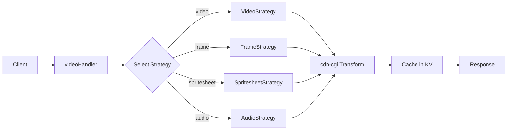
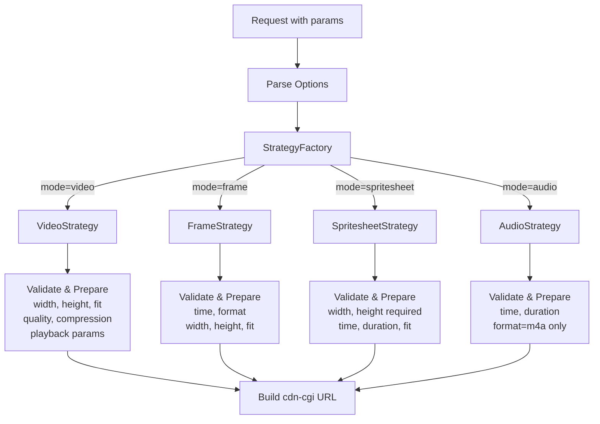
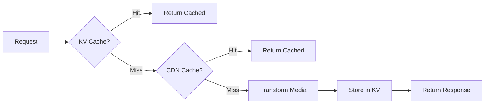
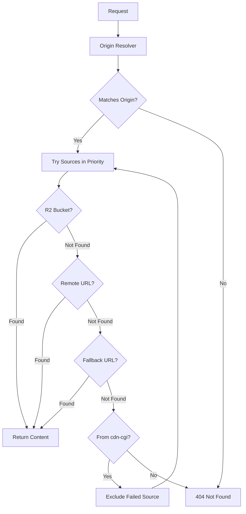

import { Aside, Card, CardGrid } from "@astrojs/starlight/components";

How [**video-resizer**](https://github.com/erfianugrah/video-resizer) handles media transformation on Cloudflare Workers.

Single endpoint for video resize, frame extraction, spritesheet generation, and audio extraction. Configuration lives in KV so you don't need to redeploy when changing settings. Two-layer cache (CDN edge + KV) with param validation before hitting the `cdn-cgi/media` endpoint for transformations.

## Overview

Four transformation modes:

- **Video**: Resize, compress, adjust quality/playback
- **Frame**: Extract stills at timestamps (jpg/png)
- **Spritesheet**: Grid previews for scrubbing UIs
- **Audio**: Extract m4a audio tracks

Config-driven mode enablement, strong validation, mode-specific strategies. Each mode handles its own param prep and validation (strategy pattern, nothing fancy).

## Core Concepts

### Request lifecycle

| Step      | Action                 | Details                                               |
| --------- | ---------------------- | ----------------------------------------------------- |
| 1. Parse  | Normalize query params | Config, derivatives, IMQuery, aliases, mode inference |
| 2. Select | Choose strategy        | Video / Frame / Spritesheet / Audio                   |
| 3. Build  | Create cdn-cgi URL     | Cache version, origins, path resolution               |
| 4. Cache  | Fetch & store          | KV variants + CDN edge caching                        |
| 5. Shape  | Format response        | Headers, filename, range request support              |

### Design patterns

| Pattern               | Purpose                             | Benefit                            |
| --------------------- | ----------------------------------- | ---------------------------------- |
| **Strategy per mode** | Each mode = own validation + params | Add modes without touching handler |
| **Config + schema**   | Zod validation + runtime defaults   | New modes work even if config lags |
| **Translation layer** | Map Akamai/short params to internal | Support multiple param conventions |
| **Cache separation**  | Mode-scoped KV keys                 | No collision between variants      |

### Mode capabilities

| Feature                 | Video       | Frame       | Spritesheet  | Audio      |
| ----------------------- | ----------- | ----------- | ------------ | ---------- |
| **Dimensions**          | ✓ 10–2000px | ✓ 10–2000px | ✓ Required   | ❌         |
| **Fit modes**           | ✓           | ✓           | ✓            | ❌         |
| **Time**                | ✓ 0–10m     | ✓ 0–10m     | ✓ 0–10m      | ✓ 0–10m    |
| **Duration**            | ✓ 1–300s    | ❌          | ✓ 1–300s     | ✓ 1–300s   |
| **Format control**      | ❌          | ✓ jpg/png   | ❌ JPEG only | ✓ m4a only |
| **Quality/compression** | ✓           | ❌          | ❌           | ❌         |
| **Playback params**     | ✓           | ❌          | ❌           | ❌         |

## Configuration

### Parameters

| Param      | Values                                         | Range/Rules                                            |
| ---------- | ---------------------------------------------- | ------------------------------------------------------ |
| `mode`     | `video` \| `frame` \| `spritesheet` \| `audio` | Auto-set to `audio` if `format=m4a`                    |
| `format`   | `jpg` \| `png` \| `m4a`                        | Frame: jpg/png, Audio: m4a, Video: ❌, Spritesheet: ❌ |
| `time`     | `0s` – `10m`                                   | Default: `0s` (start position)                         |
| `duration` | `1s` – `300s`                                  | Omit = full length (up to platform limits)             |
| `width`    | `10` – `2000`                                  | Required for spritesheet                               |
| `height`   | `10` – `2000`                                  | Required for spritesheet                               |
| `fit`      | `contain` \| `scale-down` \| `cover`           | Video/Frame/Spritesheet only                           |

:::note[Audio mode restrictions]
Audio disallows: `width`, `height`, `fit`, `quality`, `compression`, playback params
:::

### Cache model

**KV keys:** `mode:path:param1=value1:param2=value2`

```
audio:rocky.mp4:duration=120s:t=30s:f=m4a
video:sample.mp4:w=1280:h=720:q=high
frame:clip.mp4:t=5s:w=640:h=360:f=png
```

**cdn-cgi URL:** Includes all transform params + optional `version` for cache busting

**Headers:** Auto-corrected `Content-Type` per mode, optional `Content-Disposition` filename

## Development

### Extending the system

| Task              | Steps                                                                                                                                                                                                 |
| ----------------- | ----------------------------------------------------------------------------------------------------------------------------------------------------------------------------------------------------- |
| **Add mode**      | 1. Implement strategy (`prepareTransformParams`, `validateOptions`, `updateDiagnostics`)<br/>2. Add case to `createTransformationStrategy`<br/>3. Add to config defaults/validOptions<br/>4. Document |
| **Add param**     | 1. Add to config validOptions/defaults<br/>2. Handle in option parser<br/>3. Map in param mapping<br/>4. Validate in supporting strategies                                                            |
| **Adjust limits** | Update `timeUtils` validators → Update docs/tests                                                                                                                                                     |

### Operations

```bash
# Upload config
node tools/config-wrapper.js upload \
  --config config/worker-config.json \
  --env production --token <token> --force

# Deploy
npm run deploy:prod  # requires CLOUDFLARE_API_TOKEN

# Debug
?debug=true          # adds diagnostics to response
```

## Live examples

:::tip[Test with curl]
Use `--range 0-1023` to check headers without downloading full files
:::

```bash
# Audio (auto mode via format=m4a)
curl -I "https://cdn.erfi.dev/rocky.mp4?format=m4a&filename=audio.m4a"

# Audio clip (2min from 30s)
curl -I "https://cdn.erfi.dev/rocky.mp4?mode=audio&time=30s&duration=120s"

# Frame thumbnail (PNG, 640x360)
curl -I "https://cdn.erfi.dev/rocky.mp4?mode=frame&time=4s&width=640&height=360&fit=cover&format=png"

# Spritesheet (800x600, 60s window)
curl -I "https://cdn.erfi.dev/rocky.mp4?mode=spritesheet&width=800&height=600&duration=60s"

# Video (resized + cache version)
curl -I "https://cdn.erfi.dev/rocky.mp4?width=1280&height=720&version=2"
```

### Interactive demos

<CardGrid>
  <Card title="Video" icon="video">
    <video controls width="100%" preload="metadata">
      <source src="https://cdn.erfi.dev/rocky.mp4?width=640&height=360" type="video/mp4" />
    </video>
    <small>640×360 size</small>
  </Card>

<Card title="Frame" icon="picture">
  
  <small>`.png` at 9s timestamp</small>
</Card>

<Card title="Spritesheet" icon="grid">
  
  <small>800×600 spritesheet</small>
</Card>

  <Card title="Audio" icon="microphone">
    <audio controls src="https://cdn.erfi.dev/rocky.mp4?mode=audio&time=0s&duration=30s" style="width:100%"></audio>
    <small>`m4a` audio clip</small>
  </Card>
</CardGrid>

## Architecture diagrams

### Request flow

How a request flows through the system:



### Strategy pattern for transformation modes

Each mode has its own validation and parameter preparation:



### Caching layers

Two-layer caching with KV and CDN edge:



### Origins resolution and fallback

Multi-source storage with automatic fallback:



:::note[Reference]
Refer to [Cloudflare docs](https://developers.cloudflare.com/stream/transform-videos/#options) for the latest options supported.
:::
